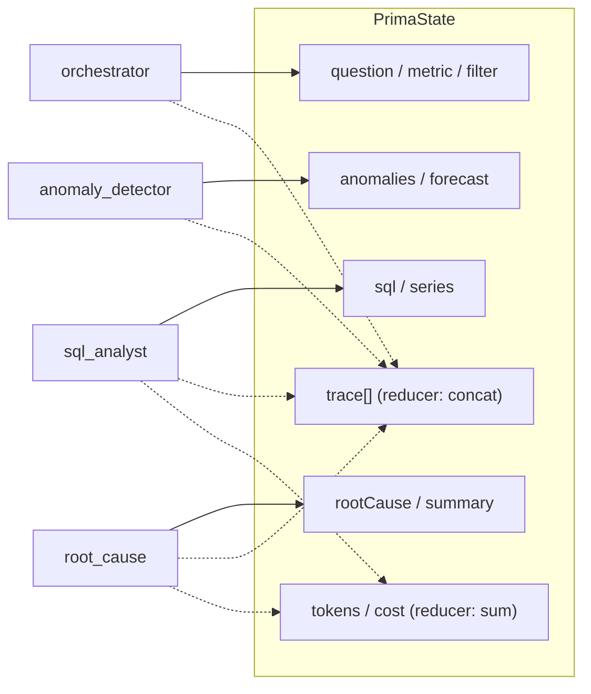

# Prima — Architecture

## Request lifecycle & agent graph

```mermaid
flowchart TB
    subgraph client["Next.js Dashboard (App Router)"]
        UI["Ask bar + KPIs + charts<br/>dataset picker + agent trace + eval scorecard"]
    end

    subgraph api["API routes (Node runtime)"]
        AN["POST /api/analyze<br/><i>{ question, dataset }</i>"]
        FU["GET /api/feature-usage"]
        EV["GET /api/eval"]
        DS["GET /api/datasets<br/><i>picker options</i>"]
        KP["GET /api/kpi<br/><i>AIOps viewer sample</i>"]
    end

    subgraph graph["LangGraph state graph — runPrima()"]
        direction TB
        O["orchestrator<br/><i>parse metric + scope</i>"]
        SQL["sql_analyst<br/><i>write + guard + run SQL</i>"]
        AD["anomaly_detector<br/><i>seasonal-naive MAD z-score + EVT</i>"]
        FC["forecaster<br/><i>Chronos-Bolt → HW fallback</i>"]
        RC["root_cause<br/><i>correlate deploys + segments</i>"]
        NR["narrator<br/><i>prescriptive briefing</i>"]
        O --> SQL --> AD --> FC --> RC --> NR
    end

    subgraph deps["Capabilities"]
        DSCTX["datasets.ts + datasetContext.ts<br/>per-request warehouse (AsyncLocalStorage)"]
        DB[("SQLite warehouses<br/>real · synthetic<br/>activity + deploys")]
        STATS["stats.ts<br/>decompose / detect / forecast"]
        ML["ml-service (FastAPI + PyTorch)<br/>Chronos-Bolt · OmniAnomaly (benchmark)"]
        LLM["llm.ts<br/>Claude (Anthropic SDK)"]
    end

    subgraph evalsys["Evaluation"]
        GOLD["golden.ts<br/>5 pinned cases"]
        SCORE["evaluate.ts<br/>routing · SQL · recall<br/>hallucination · latency · cost"]
    end

    UI --> AN --> graph
    UI --> FU --> DB
    UI --> EV --> SCORE
    UI --> DS
    UI --> KP

    AN -.->|select warehouse| DSCTX
    DSCTX --> DB
    SQL <-->|read-only guarded query| DB
    SQL -.->|generate SQL| LLM
    AD --> STATS
    FC -.->|zero-shot forecast| ML
    FC --> STATS
    RC <-->|deploy + segment SQL| DB
    RC -.->|hypotheses| LLM
    NR -.->|summary| LLM

    SCORE --> graph
    GOLD --> SCORE
    NR ==>|series · anomalies · forecast<br/>root cause · trace · telemetry| UI
```

## State accumulation (LangGraph reducers)

Each node returns a partial state update. Scalar fields are last-write-wins;
`trace`, `tokensIn`, `tokensOut`, and `costUsd` use **reducers** that concatenate /
sum across nodes, so the dashboard sees the full run telemetry.



## LLM vs. deterministic compute

| Node | Engine |
|---|---|
| SQL Analyst | **live Claude** generates SQL → read-only guard → executed (safe template only if the model's SQL is rejected) |
| Root-Cause / Narrator | **live Claude** writes hypotheses + executive briefing |
| Anomaly Detector | **statistical-only** — seasonal-naive MAD z-score (Node) with a self-calibrating **EVT/POT (SPOT)** threshold. The **PyTorch OmniAnomaly detector** ([ml-service/](ml-service/)) is kept as a *benchmarked reference*, not in the live path — it's a multivariate model that wins on SMD telemetry (strict AUC-PR ~2.7× the z-score) but is out of its regime on Prima's single clean daily KPI, where the z-score is the right tool |
| Forecaster | zero-shot **Chronos-Bolt** foundation model (ml-service), **Holt-Winters** fallback when the service is offline |
| Orchestrator / segments | **deterministic code** (parsing, SQL aggregation) |
| Cost telemetry | live token usage × model price |

`ANTHROPIC_API_KEY` is required — the LLM-backed agents always call a real model.
The statistical core never depends on the LLM, so anomaly detection, forecasting,
and segment attribution are reproducible regardless of model output.

## Rate & quota controls

Two limiters keep the LLM path safe and affordable ([src/lib/rateLimit.ts](src/lib/rateLimit.ts)):

- **Per-caller quota** — `/api/analyze` checks a per-IP token bucket *before* invoking
  the graph, so a throttled request spends **zero** model tokens (returns `429` +
  `Retry-After`). Tune with `PRIMA_RATE_BURST` / `PRIMA_RATE_PER_MIN`.
- **Global concurrency gate** — every Claude call passes through one shared semaphore
  ([src/lib/llm.ts](src/lib/llm.ts)) sized to the provider quota (`PRIMA_LLM_CONCURRENCY`),
  so total in-flight calls stay bounded no matter how many requests arrive at once.

Both are in-memory (per Fly machine); a multi-instance deploy would back them with a
shared store. Inputs are also capped at the boundary (`max_tokens` per call, max
question length on `/api/analyze`).

## Datasets & per-request warehouse selection

The dashboard's **dataset picker** lets a request target a different warehouse. The
`/api/analyze` route resolves the chosen dataset, ensures its warehouse exists, and runs
the graph inside `runWithDbPath()` ([src/lib/datasetContext.ts](src/lib/datasetContext.ts)),
an `AsyncLocalStorage` scope the db layer reads — so the agent nodes stay dataset-agnostic.

| Dataset | Kind | Backing |
|---|---|---|
| Online Retail (real) | agent | auto-bootstrapped UCI warehouse (default `DB_PATH`) |
| Synthetic storyline | agent | built on demand into `prima-synthetic.db` |
| AIOps KPI (real) | viewer | bundled `data/aiops-sample.json`, served via `/api/kpi` — **read-only**, not analyzed by the agent |

The two *agent* datasets share the `user_activity` / `deploys` schema; the registry and
the agent/viewer split live in [src/lib/datasets.ts](src/lib/datasets.ts).
