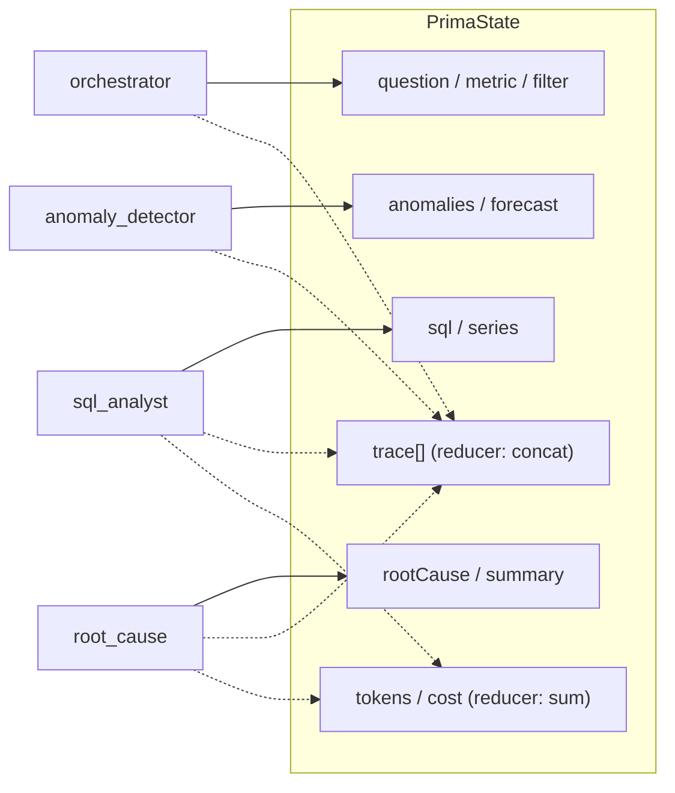

# Prima — Architecture

## Request lifecycle & agent graph

```mermaid
flowchart TB
    subgraph client["Next.js Dashboard (App Router)"]
        UI["Ask bar + KPIs + charts<br/>agent trace + eval scorecard"]
    end

    subgraph api["API routes (Node runtime)"]
        AN["POST /api/analyze"]
        FU["GET /api/feature-usage"]
        EV["GET /api/eval"]
    end

    subgraph graph["LangGraph state graph — runPrima()"]
        direction TB
        O["orchestrator<br/><i>parse metric + scope</i>"]
        SQL["sql_analyst<br/><i>write + guard + run SQL</i>"]
        AD["anomaly_detector<br/><i>seasonal-naive MAD z-score</i>"]
        FC["forecaster<br/><i>Holt-Winters + band</i>"]
        RC["root_cause<br/><i>correlate deploys + segments</i>"]
        NR["narrator<br/><i>prescriptive briefing</i>"]
        O --> SQL --> AD --> FC --> RC --> NR
    end

    subgraph deps["Capabilities"]
        DB[("SQLite warehouse<br/>~600k activity rows<br/>+ deploys")]
        STATS["stats.ts<br/>decompose / detect / forecast"]
        LLM["llm.ts<br/>Claude (Anthropic SDK)"]
    end

    subgraph evalsys["Evaluation"]
        GOLD["golden.ts<br/>5 pinned cases"]
        SCORE["evaluate.ts<br/>routing · SQL · recall<br/>hallucination · latency · cost"]
    end

    UI --> AN --> graph
    UI --> FU --> DB
    UI --> EV --> SCORE

    SQL <-->|read-only guarded query| DB
    SQL -.->|generate SQL| LLM
    AD --> STATS
    FC --> STATS
    RC <-->|deploy + segment SQL| DB
    RC -.->|hypotheses| LLM
    NR -.->|summary| LLM

    SCORE --> graph
    GOLD --> SCORE
    NR ==>|series · anomalies · forecast<br/>root cause · trace · telemetry| UI
```

## State accumulation (LangGraph reducers)

Each node returns a partial state update. Scalar fields are last-write-wins;
`trace`, `tokensIn`, `tokensOut`, and `costUsd` use **reducers** that concatenate /
sum across nodes, so the dashboard sees the full run telemetry.



## LLM vs. deterministic compute

| Node | Engine |
|---|---|
| SQL Analyst | **live Claude** generates SQL → read-only guard → executed (safe template only if the model's SQL is rejected) |
| Root-Cause / Narrator | **live Claude** writes hypotheses + executive briefing |
| Anomaly Detector | **2-detector ensemble** — statistical z-score (Node) fused with a **PyTorch Donut-VAE** from the FastAPI microservice; EVT/POT thresholds ([ml-service/](ml-service/)) |
| Forecaster | zero-shot **Chronos-Bolt** foundation model (ml-service), **Holt-Winters** fallback offline |
| Orchestrator / segments | **deterministic code** (parsing, SQL aggregation) |
| Cost telemetry | live token usage × model price |

`ANTHROPIC_API_KEY` is required — the LLM-backed agents always call a real model.
The statistical core never depends on the LLM, so anomaly detection, forecasting,
and segment attribution are reproducible regardless of model output.
