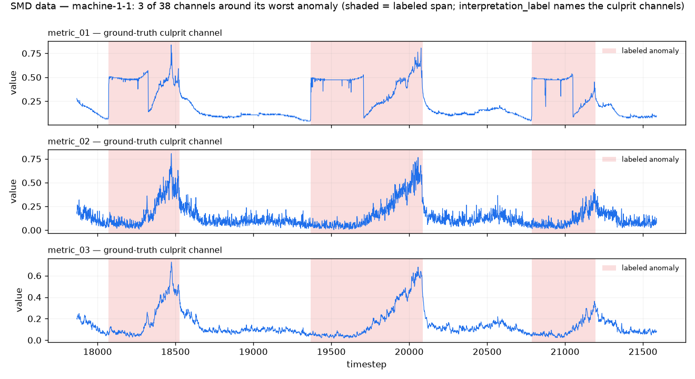

# Prima ML Service — OmniAnomaly Detector

A small standalone service (**Python / FastAPI + PyTorch**) that finds anomalies in
time series. Its deep model is **OmniAnomaly** — a *stochastic-RNN VAE* that learns
what "normal" jointly looks like across many channels, then flags any point it
can't reconstruct well. The cutoff between "normal" and "anomaly" is set
automatically by **EVT/POT (SPOT)** — a method that calibrates the threshold from
the data instead of a hand-picked number. No labels needed.

> **Quick status:** Prima's live agent uses the **simple statistical detector
> only**. The benchmarks below show why: OmniAnomaly is built for *many correlated
> channels at once* (SMD server telemetry), and on Prima's one clean daily metric a
> z-score is the right tool. This service stays around as a **benchmarked
> reference** — and it still runs the Chronos forecaster. OmniAnomaly earns its keep
> on multivariate telemetry — see **Benchmark B (SMD)**, the dataset it was
> introduced on.

## How it works (the model)

This is a PyTorch port of **OmniAnomaly** (Su et al., *Robust Anomaly Detection for
Multivariate Time Series through Stochastic Recurrent Neural Network*, KDD'19),
following the authors' code: <https://github.com/NetManAIOps/OmniAnomaly>.
OmniAnomaly is more than a recurrent autoencoder, and its **signature mechanisms**
are all here (`model.py`) — a port that drops one of these isn't OmniAnomaly:

1. **A GRU in both nets.** A GRU reads the input window in the inference net and a
   GRU drives the generative net, so the latent carries *temporal* context rather
   than being inferred per-timestep i.i.d. This is the "recurrent" in stochastic-RNN.
2. **A temporally-connected stochastic latent.** The prior is a learned
   *linear-Gaussian transition* `p(z_t | z_{t-1})` (a Linear Gaussian State Space
   Model), so latents are stochastically linked across time, not an independent
   `N(0, I)` per step.
3. **Planar Normalizing Flows** (Rezende & Mohamed '15) on the posterior `q(z_t|·)`,
   OmniAnomaly's way of getting a non-Gaussian, higher-capacity posterior.
4. **A Gaussian reconstruction** `p(x_t|z_t) = N(μ, σ)` — the decoder emits a mean
   *and* a spread, so the anomaly score is a real reconstruction *probability*, not
   an L2 error.

The model is trained by maximizing the per-timestep **ELBO** (SGVB), and the final
anomaly score is the **negative** average log-probability over `n_z` posterior
samples, taken at the last point of each window (higher = more anomalous). That
keeps both threshold methods (EVT/POT and MAD) working the same way.

**Why multivariate matters.** SMD's anomalies are channels that are individually
plausible but *jointly* impossible — a correlation breaking. One OmniAnomaly model
sees all 38 channels at once, so it can score that; a per-channel detector that
looks at one signal at a time cannot. That joint view is the whole reason to prefer
it over the z-score *on multivariate data* — and the reason it has nothing to add on
a single clean univariate series (Benchmark A).

**Deviations from the reference** (flagged per the mle workflow — see caveats by the
numbers): the latent transition is a single learned linear-Gaussian map rather than
the original's full LGSSM/Kalman parameterization; planar flows default to `K=4` (the
paper stacks ~20 on long streams); training is capped (epochs / points) for
CPU/per-request use. These are cost trade-offs; the benchmark numbers below are
reported *with* these compromises stated, not hidden.

## Run

```bash
npm run ml          # from repo root — sets up the venv on first run
# or directly:
cd ml-service && ./run.sh
```

Listens on `http://127.0.0.1:8000` (change with `ML_PORT`).

## API

`POST /detect`
```jsonc
{
  "series": [{"date": "2011-01-01", "value": 63}, ...],
  "model": "omni",      // "omni"
  "threshold": "evt",   // "evt" (SPOT/POT, self-calibrating) | "mad" (median ± k·MAD)
  "window": 28,         // how many points the model looks at together (~4 weekly cycles)
  "epochs": 150,        // training epochs (the model is cached per series)
  "q": 0.02,            // EVT target false-alarm rate (use "k" instead for mad)
  "n_z": 256            // posterior samples for the reconstruction probability
}
```
The HTTP API scores **one** KPI at a time, so OmniAnomaly runs here as a
single-channel (`D=1`) series — handy as a drop-in reference, but it's the
multivariate setting (`bench_smd.py`) where the model actually pays off. Returns
per-point scores (negative reconstruction log-prob), the list of anomalies (each
with a severity and a robust z-score), and training info (`train_ms`, `final_loss`
= the converged −ELBO).

`POST /forecast`
```jsonc
{ "series": [{"date":"2011-01-01","value":63}, ...], "horizon": 14 }
```
A zero-shot forecast from **Chronos-Bolt** (`amazon/chronos-bolt-small`, a pretrained
time-series model). Returns `median` plus `lower`/`upper` (p10/p90) — it does **not**
train on your series. The ~48MB model downloads from HuggingFace the first time and is
then cached.

`GET /health` → lists the models, threshold options, and the forecaster.

## Design notes

- **Localized scoring** — each point is scored using the window that *ends* on it, so
  one anomaly's signal doesn't smear onto its neighbors.
- **Robust threshold** — the cutoff uses median/MAD (the same robust statistic the
  Node side uses), so a few big anomalies can't drag the cutoff up around themselves.
- **Cached training** — the trained model is keyed by a hash of the input series *and*
  its hyperparameters, so the same request comes back instantly (and a different
  `window`/`hidden`/`latent` never silently returns a stale model).
- **Reproducible** — `torch.manual_seed(42)`; scoring uses a seeded generator so a
  given `(series, params)` returns identical scores.

This mirrors a common production setup: an unsupervised anomaly model served behind
its own API, used by the rest of the system over the network.

## Benchmark A — synthetic Prima series (right tool for the regime?)


`npm run bench:detectors` runs two settings (12 seeds each, AR(1)/Laplace noise, with
point + collective + level-shift anomalies). AUC-PR/VUS-PR are averaged per seed
(mean±std); precision/recall/F1 are **pooled across seeds** so they rest on 150–190
real anomaly points, not the ~13 a single seed would give. The deep detector here is
OmniAnomaly run on the single daily channel (`OMNI_WINDOW=28`, ~4 weekly cycles).

Note: for AUC-PR the "no skill" floor is the share of points that are actually
anomalies (~0.07–0.09 here), not 0.5.

**Large anomalies** — 40–80% deviations (156 pooled positives):

| detector | AUC-PR | VUS-PR | P / R / F1 |
|---|---|---|---|
| statistical (EVT) | **1.000 ± 0.000** | 0.673 | 1.00 / 0.22 / 0.36 |
| omni | 0.999 ± 0.003 | 0.629 | 1.00 / 0.28 / 0.44 |
| ensemble — mean score | 1.000 ± 0.000 | 0.652 | — |
| ensemble — union (≥1) | — | — | 1.00 / 0.33 / **0.49** |
| ensemble — intersect (≥2) | — | — | 1.00 / 0.17 / 0.29 |

**Subtle anomalies** — 10–20% deviations, about the size of the normal weekly swing
(192 pooled positives):

| detector | AUC-PR | VUS-PR | P / R / F1 |
|---|---|---|---|
| statistical (EVT) | **0.949 ± 0.033** | 0.702 | 1.00 / 0.18 / 0.30 |
| omni | 0.238 ± 0.089 | 0.396 | 0.53 / 0.09 / 0.16 |
| ensemble — mean score | 0.818 ± 0.123 | 0.628 | — |
| ensemble — union (≥1) | — | — | 0.73 / 0.22 / **0.34** |
| ensemble — intersect (≥2) | — | — | 1.00 / 0.05 / 0.09 |

**The headline finding — OmniAnomaly is out of its design regime here.** On a single
clean daily series there are no *cross-channel* correlations to exploit, which is the
only thing OmniAnomaly's joint model buys you. On large anomalies it ties the z-score
(AUC-PR 0.999 vs 1.000) because anything separates a 60% spike. On **subtle**
anomalies it collapses (AUC-PR **0.238** vs the z-score's **0.949**): it cannot tell a
15% dip from normal seasonal movement on one channel. The seasonal z-score, which is
*built* for exactly that one-clean-series case, dominates.

**So, do we need the ensemble?** No, not on Prima's metric.

- **Large anomalies — no.** Both detectors are near-perfect AUC-PR; the union rule
  nudges pooled F1 to 0.49 (vs 0.44 / 0.36) on recall, but the statistical detector
  alone already finds every spike eventually.
- **Subtle anomalies — no.** With OmniAnomaly so weak here, the union now *hurts*
  precision (0.73) and barely moves F1 (0.34 vs the z-score's 0.30); the mean-score
  ensemble (AUC-PR 0.818) is dragged *below* the z-score alone (0.949). The right move
  on one clean daily series is the z-score by itself.
- **The "agreement" (intersect ≥2) gate is the worst everywhere** (subtle F1 0.09).
  Demanding two detectors agree throws away the different-but-correct catches that are
  the only reason to run two detectors — never gate on it.

That's why the ensemble and the agreement vote were dropped from the agent: on Prima's
one clean daily metric the statistical detector wins, and the deep model only earns
its place on *multivariate* telemetry (Benchmark B).

## Benchmark B — real SMD with OmniAnomaly (the multivariate showcase)



SMD (Server Machine Dataset) is the dataset OmniAnomaly was introduced on: 28 server
entities, each **38 metric channels**, a clean `train` split, a `test` split, and
per-point `test_label`s. Its anomalies are *multivariate* — correlations breaking —
so this is OmniAnomaly's **design regime**. `ml-service/bench_smd.py` trains **one
OmniAnomaly model per entity over all 38 channels at once** on the clean `train`
split, scores `test` (real split, no peeking), and grades against `test_label`. The
baseline is the honest dependency-free comparison: a causal rolling-median robust
z-score scored *per channel* and max-aggregated (it can only see one channel move at a
time).

We report a **strict** metric, a **lenient** one, *and* the **deployed** threshold's
F1 — never just the flattering number (see `metrics.py`):

```bash
# capped validation run reproduced below (~95s on CPU, 3 entities):
MACHINES=machine-1-1,machine-2-1,machine-3-1 EPOCHS=10 WIN=60 TRAIN_N=12000 \
  N_Z=16 HIDDEN=32 LATENT=8 ml-service/.venv/bin/python ml-service/bench_smd.py
```

| entity | z best-F1 | **omni best-F1** | z AUC-PR | **omni AUC-PR** | omni EVT-F1 |
|---|---|---|---|---|---|
| machine-1-1 | 0.936 | 0.999 | 0.211 | **0.415** | 0.341 |
| machine-2-1 | 0.870 | 0.962 | 0.054 | **0.164** | 0.860 |
| machine-3-1 | 0.865 | 0.945 | 0.105 | **0.413** | 0.576 |
| **macro mean** | 0.891 | **0.969** | 0.123 | **0.331** | 0.593 |

- **strict point-wise AUC-PR** — OmniAnomaly **0.331 vs the baseline's 0.123**, ~2.7×
  better, and several× above the 1–9% anomaly floor. This is the meaningful win: on
  the actual point-wise ranking, the joint multivariate model separates anomalies the
  per-channel z-score can't.
- **point-adjusted best-F1 (lenient/oracle)** — OmniAnomaly 0.969 macro, landing in /
  above OmniAnomaly's published SMD best-F1 (~0.88–0.90, also point-adjusted) — evidence
  the port is faithful. It's a generous metric (one hit credits a whole segment), so we
  pair it with the strict number above and the deployed one below.
- **deployed EVT-F1** — 0.593 macro at the self-calibrating POT cutoff, well below the
  oracle 0.969. That gap is the same honest finding the statistical SMD benchmark
  surfaced: the *signal* is strong; the weak link is picking a per-entity threshold.

> **Caveats (per the mle workflow):** this is a **capped validation** run — 3 of 28
> entities, 12k of ~28k train points, 10 epochs, `n_z=16`, `K=4` flows — chosen to
> confirm the port reproduces OmniAnomaly's published range quickly on CPU, *not* a
> full paper-scale sweep. A full run (`MACHINES=` all 28, more epochs, `N_Z` higher) is
> the obvious next step; the macro mean would shift, but the strict-AUC-PR gap over the
> per-channel baseline is the result that justifies shipping OmniAnomaly *for SMD*.

## Verdict — which detector, where

Putting the three benchmarks together:

- **Prima's one clean daily metric → the statistical z-score (EVT/POT) alone.**
  OmniAnomaly is out of its design regime on a single univariate series (Benchmark A
  subtle: AUC-PR 0.238 vs 0.949); the ensemble and the "agreement ≥2" gate make it
  worse, not better. This is the path the live agent ships
  ([`src/agents/nodes.ts`](../src/agents/nodes.ts)): seasonal z-score, EVT/POT, no deep
  call, no agreement gate.
- **Multivariate server telemetry (SMD) → OmniAnomaly.** One model over all channels
  beats the per-channel z-score ~2.7× on strict AUC-PR (Benchmark B) by scoring
  correlations breaking — exactly what a per-channel detector is blind to. This is why
  OmniAnomaly is the deep detector in the repo.
- **The deep model stays a benchmarked reference.** It would be worth wiring into the
  live path the day Prima starts monitoring many correlated, higher-frequency metrics
  per entity — the SMD case. Until then the evidence here is the decision: keep it
  benchmarked, ship the z-score.
