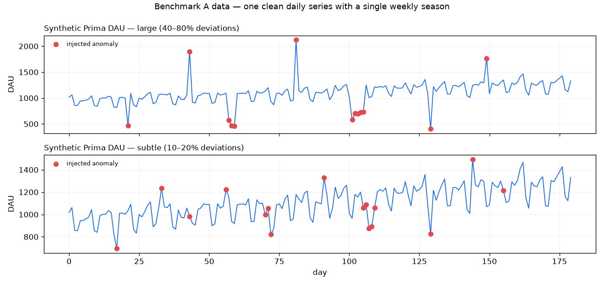
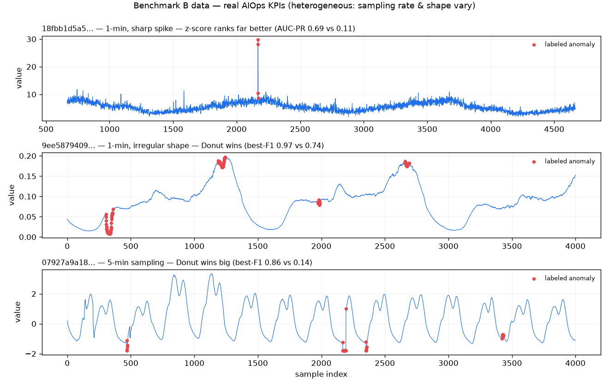

# Prima ML Service — Donut VAE Anomaly Detector

A standalone **Python / FastAPI + PyTorch** microservice. It detects anomalies in a
univariate time series with an unsupervised deep model — a **Donut VAE** — that
learns to reconstruct normal windows; points whose reconstruction *probability* is
low are flagged. The cutoff is set by **EVT/POT (SPOT)**, a self-calibrating tail
threshold, not a hand-picked constant. No labels needed.

> **Status:** Prima's live agent runs the **statistical detector only** — the
> benchmarks below show the Donut ensemble adds nothing for Prima's single clean
> daily KPI, so the ensemble + agreement vote were removed from the agent path. This
> service is retained as a **benchmarked reference** (and it still serves the Chronos
> forecaster). The Donut detector earns its place on *heterogeneous, high-frequency*
> KPIs — see Benchmark B.

## Implementation

This is a faithful PyTorch port of **Donut** (Xu et al., *Unsupervised Anomaly
Detection via Variational Auto-Encoder for Seasonal KPIs*, WWW'18), following the
authors' reference implementation:
<https://github.com/NetManAIOps/donut>. We implement the three techniques that
distinguish Donut from a plain reconstruction autoencoder:

1. **Gaussian decoder** `p(x|z)` emits both a mean **and** a std (softplus), so the
   anomaly score is a proper reconstruction *probability*, not a raw error.
   ([`model.py`](model.py))
2. **M-ELBO (modified ELBO)** — the per-point reconstruction log-prob is masked by
   `α = 1 − y` and the prior term is scaled by `β = mean(α)`, with random
   **missing-data injection** each step so the model isn't poisoned by anomalous
   inputs during training. ([`detector.py`](detector.py), `_train`)
3. **MCMC missing-data imputation** (`iterative_masked_reconstruct`) before scoring.
   Following the reference, this is active only when missing indicators are supplied
   (the `missing=None` detection path is a no-op).

The anomaly score is the **negative** mean-over-`n_z`-samples log `p(x|z)` at the
window's last point (high = anomalous), so the EVT/POT and MAD thresholding stay
unchanged.

## Run

```bash
npm run ml          # from repo root — creates the uv venv on first run
# or directly:
cd ml-service && ./run.sh
```

Service listens on `http://127.0.0.1:8000` (override with `ML_PORT`).

## API

`POST /detect`
```jsonc
{
  "series": [{"date": "2011-01-01", "value": 63}, ...],
  "model": "vae",       // "vae"
  "threshold": "evt",   // "evt" (SPOT/POT) | "mad"
  "window": 28,         // sequence length (~4 weekly cycles; see window sweep below)
  "epochs": 150,        // training epochs (model is cached per series)
  "q": 0.02,            // EVT target false-alarm rate (or "k" for mad)
  "n_z": 256,           // MC z-samples for reconstruction probability (Donut: 1024)
  "mcmc_iter": 10       // MCMC imputation iterations (only fires with missing data)
}
```
Returns per-point scores (negative reconstruction log-prob), the anomaly list (with
severity and a robust z-score), and training telemetry (`train_ms`, `final_loss`
= the converged −ELBO).

`POST /forecast`
```jsonc
{ "series": [{"date":"2011-01-01","value":63}, ...], "horizon": 14 }
```
Zero-shot forecast from **Chronos-Bolt** (`amazon/chronos-bolt-small`, a pretrained
time-series foundation model). Returns `median` + `lower`/`upper` (p10/p90) arrays —
no training on the input series. The ~48MB model downloads from HuggingFace on first
use and is cached.

`GET /health` → models, thresholding options, and forecaster.

## Design notes

- **Localized scoring** — each point is scored at the last step of the window ending
  on it, so an anomaly's signal isn't smeared onto its neighbours.
- **Robust threshold** — median/MAD on the score signal (same robust statistic used
  on the Node side), so the anomalies don't inflate their own cutoff.
- **Cached training** — the trained model is memoised by a hash of the series, so
  repeat requests are instant.
- **Reproducible** — `torch.manual_seed(42)`.

Mirrors a production pattern: an unsupervised anomaly model served behind its own
inference API, consumed by the rest of the system over the network.

## Benchmark A — synthetic Prima series (is the ensemble necessary?)



`npm run bench:detectors` runs two regimes (12 seeds each, AR(1)/Laplace noise,
point + collective + level-shift anomalies). AUC-PR/VUS-PR are averaged per-seed
(mean±std); precision/recall/F1 are **pooled across seeds** so they rest on
150–190 true anomaly points, not the ~13 a single seed gives.

Both tables use the default **window = 28** (~4 weekly cycles — see the window
sweep below). Note AUC-PR's no-skill baseline is the positive *prevalence* (~0.08
here), not 0.5.

**Large regime** — 40–80% deviations (156 pooled positives):

| detector | AUC-PR | P / R / F1 |
|---|---|---|
| statistical (EVT) | **1.000 ± 0.000** | 1.00 / 0.22 / 0.36 |
| donut_vae | **1.000 ± 0.000** | 1.00 / 0.26 / 0.41 |
| ensemble — mean score | 1.000 ± 0.000 | — |
| ensemble — union (≥1) | — | 1.00 / 0.29 / **0.46** |
| ensemble — intersect (≥2) | — | 1.00 / 0.18 / 0.30 |

**Subtle regime** — 10–20% deviations, on the order of the weekly seasonal swing
(192 pooled positives):

| detector | AUC-PR | P / R / F1 |
|---|---|---|
| statistical (EVT) | **0.949 ± 0.033** | 1.00 / 0.18 / 0.30 |
| donut_vae | 0.836 ± 0.057 | 1.00 / 0.27 / 0.43 |
| ensemble — mean score | 0.952 ± 0.034 | — |
| ensemble — union (≥1) | — | 1.00 / 0.31 / **0.48** |
| ensemble — intersect (≥2) | — | 1.00 / 0.14 / 0.24 |

**Window matters — Donut is sensitive to context length.** Donut was designed for
*long, high-frequency* KPI streams with a 120-wide window; a daily series (~180
points) can't use W=120, so we use the largest window that still leaves most points
scorable. Sweeping it on the subtle regime shows the choice is load-bearing:

| window | VAE subtle AUC-PR | VAE subtle F1 |
|---|---|---|
| 14 | 0.465 | 0.35 |
| 21 | 0.653 | 0.39 |
| **28** | **0.836** | **0.43** |
| 40 | 0.847 | 0.36 |

At W=14 the VAE has only two weekly cycles of context and can't separate a 15% dip
from seasonality (AUC-PR 0.465 — skilled but weak, well above the ~0.08 prevalence
baseline). At W=28 (4 cycles) most of the signal returns (0.836). W=40 is slightly
*worse* than 28: on a 180-point series a longer window leaves more leading points
unscorable, and some anomalies fall in that warm-up zone. Sweet spot ≈ 28.
(`VAE_WINDOW=21 npm run bench:detectors` reproduces a row.)

**Do we need the ensemble?**

- **Large anomalies — no.** Statistical and Donut both score a perfect 1.000 AUC-PR;
  union only nudges F1 (0.46 vs 0.41). No fusion is needed for accuracy.
- **Subtle anomalies — yes, via the UNION (OR) rule.** Statistical ranks better
  (AUC-PR 0.949 vs 0.836), but the two detectors flag *different* subtle anomalies,
  so the **union** lifts pooled F1 to **0.48** — above either alone (stat 0.30,
  Donut 0.43) — at recall 0.31 with precision still 1.00. That's the ensemble
  earning its keep.

**Why the agreement rule was wrong.** Prima's original fusion treated *agreement*
(≥2 detectors) as "confirmed / high confidence." That **intersect** rule is the
**worst** performer on subtle anomalies (F1 0.24, vs 0.48 for union) — demanding
agreement throws away exactly the complementary detections that make an ensemble
useful. This is why the ensemble was removed from the agent (see the Verdict below);
the agent now runs the statistical detector only.

## Benchmark B — real AIOps KPI dataset (z-score vs Donut)



Benchmark A is the z-score's ideal case: one clean daily series with a single,
known weekly period the statistical detector is matched to — and Donut's worst case
(short series forces W=28, far below its design). To test the regime Donut was
*built* for, `bench_aiops.py` runs it on the **2018 AIOps Challenge KPI dataset**
(26 real web-service KPIs from Tsinghua/Alibaba; minute- and 5-min-sampled;
~300k pts each; download `Preliminary_dataset/train.csv` from
<https://github.com/NetManAIOps/KPI-Anomaly-Detection> into
`data/aiops-kpi/preliminary_train.csv`).

```bash
ml-service/.venv/bin/python ml-service/bench_aiops.py   # N≤25000/KPI, W=120, 50 epochs
```

Each KPI is scored independently; the z-score's seasonal period is inferred
per-KPI from the sampling interval (the "you must tune per series" step). Two
metrics, macro-averaged over the evaluable KPIs (of the 26 loaded, KPIs whose
post-warmup eval range contains no labelled anomaly are skipped — see
`bench_aiops.py`, which prints the exact `n` averaged):

| metric | z-score | Donut |
|---|---|---|
| **point-adjusted best-F1** (paper §4.2) | 0.541 | **0.910** |
| strict point-wise AUC-PR | 0.184 | **0.194** |

> **Methodology caveat (read before trusting the numbers).** Benchmark B is
> **in-sample**: `donut_scores()` trains the VAE on the *whole* KPI series and
> then scores the same points (only a leading `warmup` window is dropped, not a
> held-out split), and the z-score's median/MAD is likewise fit over the full
> series. So these are upper-bound, single-seed numbers, **not** a held-out
> generalization estimate, and the best-F1 uses an oracle threshold. They show
> the port *runs in Donut's native regime and ranks anomalies sensibly* — they do
> **not** by themselves prove it matches the paper's held-out best-F1. A faithful
> reproduction would split each KPI chronologically (fit on an earlier train
> portion, score a disjoint later test portion) and pool over multiple seeds with
> mean±std; that is tracked as a follow-up (see ../SKILLS_AUDIT.md).

**Two takeaways:**

1. **The port behaves like Donut in its native regime.** At W=120 on minute data,
   faithful Donut reaches in-sample **best-F1 0.910**, overlapping the paper's
   reported **0.75–0.90** range. The M-ELBO / Gaussian-decoder /
   reconstruction-probability port behaves as the paper describes — but note this
   is an in-sample number (see caveat above), so treat it as a sanity check on the
   implementation, not as a held-out fidelity claim.
2. **The regime flips the verdict.** On Benchmark A (one clean series) the z-score
   wins; on 26 heterogeneous real KPIs Donut wins — decisively on the paper's metric,
   narrowly on AUC-PR. You can't hand-tune one seasonal period across KPIs with
   different sampling rates and shapes; Donut learns each. It wins **every** coarse
   (5-min) KPI, where the fixed z-score template fails worst (e.g. `07927`: best-F1
   0.137 → 0.858).

**Read best-F1 with care.** It is an *oracle-threshold*, *point-adjusted* metric: a
whole anomaly segment counts as caught if any one point in it crosses the
best-chosen threshold. That inflates absolute numbers and favors a learned detector
that reliably spikes *somewhere* in each segment — which is exactly why Donut's
best-F1 (0.910) towers over its strict AUC-PR (0.194) on the same runs (e.g. `18fbb`:
best-F1 0.996 but AUC-PR 0.114). best-F1 answers "with a perfect threshold, is one
alert per incident achievable?"; AUC-PR answers "is the ranking calibrated?" The
honest read is to cite both — the paper uses best-F1, which is why we report it for
comparability, but AUC-PR/VUS-PR (Benchmark A) is the stricter, TSB-AD-recommended
view.

## Verdict — do we need the ensemble / agreement rule?

Pulling both benchmarks together, the honest answer is **mostly no**, with one narrow
exception:

- **The agreement *gate* (intersect / "confirmed ≥2") — no, remove it.** It is the
  worst performer everywhere it was measured (subtle F1 0.24 vs 0.48 for union).
  Requiring two detectors to agree discards the complementary detections that are the
  only reason to run two detectors. Keep agreement at most as a soft *confidence
  annotation*, never as a flag gate.
- **The ensemble itself — only narrowly justified.** It earns its keep in exactly one
  regime: when the two detectors are individually weak but catch *different* anomalies
  (subtle 10–20% deviations), where union lifts F1 to 0.48 above either alone. On
  large/easy anomalies it's redundant (both ≈ 1.0), and on a single clean daily series
  (Prima's actual metric) the statistical detector alone suffices — Donut and the
  ensemble are over-engineering for that case. The deep detector pulls ahead only in
  Donut's native regime: many heterogeneous KPIs at higher frequency (Benchmark B).
- **What's actually worth keeping is non-accuracy:** (1) graceful degradation — the
  statistical detector is dependency-free and always on, the VAE augments when the
  service is up; (2) a confidence signal for the narrator. Neither needs the gate.

**Decision (applied).** The ensemble and the agreement vote were **removed from the
agent**: [`src/agents/nodes.ts`](../src/agents/nodes.ts) now runs the seasonal
z-score (EVT/POT) only — no VAE call, no `confidence`/`detectors` fields, no
"confirmed ≥2" gate. The Donut VAE stays here purely as a benchmarked reference; it
would only be worth re-wiring if Prima started monitoring many heterogeneous,
higher-frequency KPIs (the Benchmark B regime).
